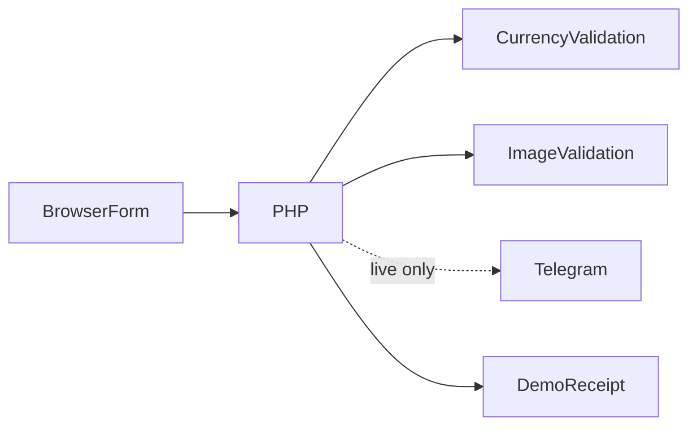
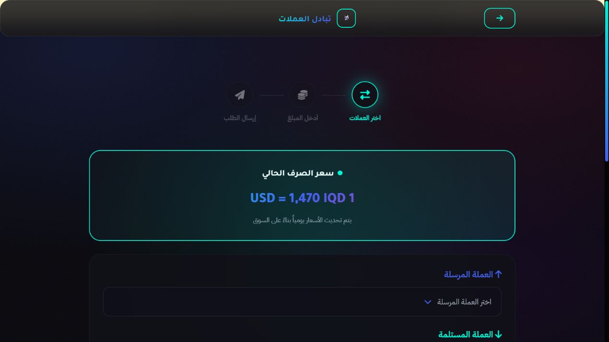

# منصة طلبات التحويل

**استقبال طلبات تحويل عربية مع صور إثبات**

[English](README.md)

جمع طلب تحويل منظم وصورة إثبات اختيارية للمشغل مع حالة إرسال واضحة.

**التقنيات:** HTML · JavaScript · PHP · Telegram

## الحالة والتاريخ

واجهة استقبال طلبات بخادم PHP وTelegram. لا تنفذ تحويلاً آلياً ولا تقدم بيانات سوق مباشرة.

هذه نسخة عرض منقحة للنشر. تعرض [وثيقة التحقق](docs/verification.ar.md) الفحوص الحالية بصورة مستقلة عن النشر السابق.

## الوظائف والإجراءات

- اختيار عملات مدعومة وحساب تقديمي ثابت
- تفاصيل المستلم والحساب وصورة إثبات اختيارية
- ضغط الصور وتقدم الإرسال في المتصفح
- فحص مبلغ وعملة ومحتوى الصورة في الخادم
- رسالة أو صورة Telegram ومعرف عملية
- وضع عرض دون الاتصال بTelegram

اختيار زوج مدعوم ← عرض تقدير ثابت ← إدخال بيانات مستلم اصطناعية ← إثبات اختياري ← فحص PHP ← قبول العرض أو تأكيد المزود ← رقم عملية من الخادم.

## البنية

## القرارات الهندسية

- يحسب الخادم السعر والرسوم التقديمية الثابتة بدلاً من الثقة بإجمالي المتصفح؛ ليست تسعيرة تداول.
- يفحص finfo وفك الصورة محتواها الفعلي دون الثقة بMIME المتصفح، بحد 5 ميغابايت.
- تُهَرَّب حقول HTML في Telegram ويُفعل TLS وتُحذف سجلات الطلبات الخام.
- يصدر الخادم معرف النجاح بدلاً من رقم المتصفح، ولا يُنشر سجل مالي أو بيانات مستلمين.

## المجلدات

| المكون | المسؤولية |
|---|---|
| `Home.html` | الواجهة العامة والتتبع التاريخي |
| `Exchange.html` | نموذج الطلب وضغط الصور |
| `post.php` | فحص الطلب وحدود المزود |
| `currency-options.json` | أسماء ورموز العملات المدعومة فعلياً |
| `logos/` | صور وشعارات المزودين الموجودة |

## التثبيت والإعداد

استخدم PHP 8.1 مع fileinfo ودوال الصورة وcURL للإرسال الفعلي. شغّل php -S 127.0.0.1:8085؛ العرض مفعّل افتراضياً. صدّر متغيرات البيئة لتفعيل المزود. لا تدخل معلومات مالية حقيقية في العرض. الأسعار والنشاط التسويقي أمثلة فقط.

توجد أوامر التشغيل ومتغيرات البيئة في [دليل الإعداد](docs/setup.ar.md). القيم أمثلة محلية أو حقول فارغة؛ لا تعِد استخدام بيانات إنتاج سابقة.

## العرض والتحقق

اختيار زوج مدعوم ← عرض تقدير ثابت ← إدخال بيانات مستلم اصطناعية ← إثبات اختياري ← فحص PHP ← قبول العرض أو تأكيد المزود ← رقم عملية من الخادم.

استخدم حسابات وسجلات اصطناعية. راجع [خطوات العرض](docs/demo.ar.md) وسجل نتائج الفحوص الحالية. نجاح بناء مكون لا يثبت نجاح كل مسارات المنتج.

## الحدود

يعرف الإيصال استقبال الطلب ولا يثبت التنفيذ المالي. التتبع العام عرض تاريخي دون سجل عمليات حي. يلزم فحص صورة إثبات صحيحة وفشل المزود قبل استقبال طلبات حقيقية.

## التوثيق

- [البنية](docs/architecture.ar.md)
- [الإعداد](docs/setup.ar.md)
- [العرض](docs/demo.ar.md)
- [المسارات](docs/api.ar.md)
- [الفحوص الحالية](docs/verification.ar.md)
- [النشر وحل المشكلات](docs/deployment.ar.md)
- [حقوق الأصول](THIRD_PARTY_NOTICES.md)

## المساهمة والترخيص

افتح مشكلة تتضمن خطوات إعادة الإنتاج والمكون المعني. استخدم بيانات اصطناعية وتعديلات مركزة وفحوصاً مناسبة، ولا ترسل أسراراً أو سجلات مستخدمين خاصة. الشيفرة بترخيص [MIT](LICENSE)، وتحتفظ الاعتماديات والأصول الخارجية بشروطها الأصلية.

<!-- release-presentation -->

## من التطبيق الفعلي

هذه لقطة فعلية للواجهة المحلية، وليست دليلاً على استخدام إنتاجي أو فحص أندرويد.

## التحقق والقراءة المتعمقة

نجحت صياغة PHP وفحوص استقبال طلب اصطناعي بلا صورة ورفض مبلغ غير صالح أو صفر أو غير محدود ورفض عملة غير مدعومة ومحتوى صورة مزيف. تحقق TLS مفعل في الشيفرة. لا ندعي إرسالاً حياً أو تنفيذ تحويل مالي.

يعرف الإيصال استقبال الطلب ولا يثبت التنفيذ المالي. التتبع العام عرض تاريخي دون سجل عمليات حي. يلزم فحص صورة إثبات صحيحة وفشل المزود قبل استقبال طلبات حقيقية.

- [دراسة المشروع](docs/case-study.ar.md)
- [التحقق](docs/verification.ar.md)
- [مخطط البنية](docs/architecture.svg)
- [صفحة المشروع](https://mohamed-abderrehmane-portfolio.wry-dog-0796.chatgpt.site/ar/projects/exchange-request-platform/)
