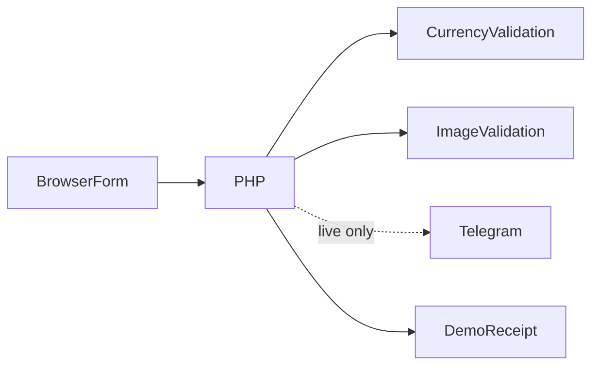

# Exchange Request Platform

**Arabic transaction intake with proof images**

[العربية](README.ar.md)

Collect a structured exchange request and optional proof image for an operator, with clear submission feedback.

**Technology:** HTML · JavaScript · PHP · Telegram

## Status and deployment history

Transaction-request interface with PHP and Telegram processing. It does not perform an automated exchange or provide live market data.

This is a sanitized portfolio release. See the current [verification record](docs/verification.md) before choosing a runtime demonstration.

## Main workflows and implemented features

- Supported currency selection and fixed conversion display
- Recipient/account details and optional proof images
- Browser image compression and submission progress
- Server amount/currency/content validation
- Telegram message or photo delivery and operation identifiers
- Demo mode accepts only a demonstration workflow without contacting Telegram

Select a supported pair → view a fixed estimate → enter synthetic recipient details → attach optional proof → PHP validates → demo accepts or provider confirms → show the server operation number.

## Architecture

## Engineering decisions

- Server conversion uses the same fixed presentation rate/fees rather than trusting a browser-submitted total. It is not a trading quote.
- finfo and image decoding validate actual upload content; browser MIME is not trusted. The server caps proof images at 5 MB.
- Telegram HTML fields are escaped, TLS verification is enabled and raw request/provider logs are removed.
- A server-issued operation ID replaces the client-generated success number. No public recipient/financial log is published.

## Directory guide

| Component | Responsibility |
|---|---|
| `Home.html` | Public presentation and historical tracking interface |
| `Exchange.html` | Request interface and compression |
| `post.php` | Validated request/provider boundary |
| `currency-options.json` | Actual supported selector labels and codes |
| `logos/` | Existing provider imagery |

## Installation

Use PHP 8.1+ with fileinfo, image functions and cURL for live mode. Run `php -S 127.0.0.1:8085`; demo mode defaults to enabled. Export environment variables to enable live provider delivery. Do not use real financial details in the public demo. The static conversion display is illustrative and generated marketing activity is not transaction evidence.

All required/private configuration is described in [setup](docs/setup.md). Examples contain placeholders or local demo values. Never reuse historical credentials.

## Demonstration

- Submit synthetic input without a proof image.
- Submit a harmless generated image and inspect demo response.
- Reject invalid amount, unsupported currencies and fake image MIME/content.
- Verify a provider failure produces an error instead of success.

## Verification and limitations

- PHP syntax
- Amount/currency/request tampering rejection
- Proof content and size validation
- TLS and Telegram escaping; response operation ID

Requests are for operator review; no automatic execution or authoritative tracking API. Retries after uncertain live delivery require reconciliation. Do not expose original logs.

## Documentation

- [Architecture](docs/architecture.md) · [العربية](docs/architecture.ar.md)
- [Setup and configuration](docs/setup.md) · [العربية](docs/setup.ar.md)
- [Demo walkthrough](docs/demo.md) · [العربية](docs/demo.ar.md)
- [API and execution paths](docs/api.md)
- [Verification record](docs/verification.md)
- [Deployment and troubleshooting](docs/deployment.md)
- [Asset attribution](THIRD_PARTY_NOTICES.md) · [MIT license](LICENSE)

## Contributing

Open an issue describing a reproducible problem, expected behavior and component involved. Use synthetic data. Keep changes focused and include relevant checks. Do not include credentials or private user records.

## License and attribution

Source code is MIT licensed. Third-party dependencies and assets retain their own terms; see [attribution](THIRD_PARTY_NOTICES.md).

<!-- release-presentation -->

## Actual application interface

Captured from the local application with synthetic records. This does not establish production usage or Android device verification.

## Verification and deeper reading

PHP syntax and HTTP checks passed: synthetic intake without a proof image, invalid/zero/non-finite amount rejection, unsupported currency rejection, and rejection of forged image MIME/content. TLS verification is enabled in source. Live provider delivery and financial execution are not claimed.

The receipt identifies request intake, not completed financial execution. Public tracking is historical presentation and does not expose a live transaction ledger. Valid proof/provider-failure cases need further checks before collecting real requests.

- [Case study](docs/case-study.md)
- [Verification](docs/verification.md)
- [Architecture diagram](docs/architecture.svg)
- [Portfolio case study](https://mohamed-abderrehmane-portfolio.wry-dog-0796.chatgpt.site/projects/exchange-request-platform/)
