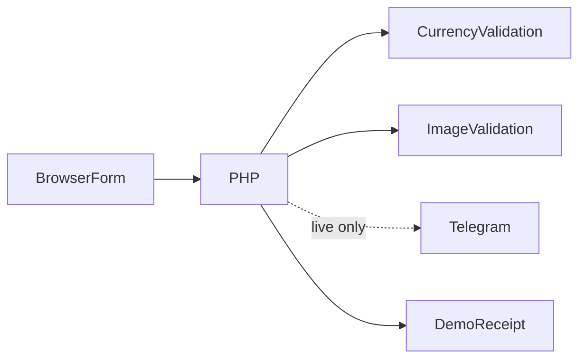

# بنية منصة طلبات التحويل

اختيار زوج مدعوم ← عرض تقدير ثابت ← إدخال بيانات مستلم اصطناعية ← إثبات اختياري ← فحص PHP ← قبول العرض أو تأكيد المزود ← رقم عملية من الخادم.

## القرارات والمفاضلات

- يحسب الخادم السعر والرسوم التقديمية الثابتة بدلاً من الثقة بإجمالي المتصفح؛ ليست تسعيرة تداول.
- يفحص finfo وفك الصورة محتواها الفعلي دون الثقة بMIME المتصفح، بحد 5 ميغابايت.
- تُهَرَّب حقول HTML في Telegram ويُفعل TLS وتُحذف سجلات الطلبات الخام.
- يصدر الخادم معرف النجاح بدلاً من رقم المتصفح، ولا يُنشر سجل مالي أو بيانات مستلمين.

## مراجع الشيفرة

- [Exchange.html](../Exchange.html)
- [post.php](../post.php)
- [currency-options.json](../currency-options.json)

## الحدود

الطلبات لمراجعة المشغل ولا تنفذ تحويلات آلية أو تتبعاً رسمياً. يلزم التحقق قبل إعادة الإرسال بعد نتيجة غير مؤكدة. لا تُنشر السجلات الأصلية.
