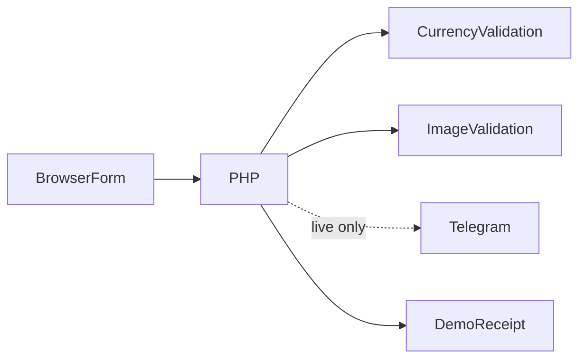

# Exchange Request Platform architecture

Select a supported pair → view a fixed estimate → enter synthetic recipient details → attach optional proof → PHP validates → demo accepts or provider confirms → show the server operation number.

## Decisions and tradeoffs

- Server conversion uses the same fixed presentation rate/fees rather than trusting a browser-submitted total. It is not a trading quote.
- finfo and image decoding validate actual upload content; browser MIME is not trusted. The server caps proof images at 5 MB.
- Telegram HTML fields are escaped, TLS verification is enabled and raw request/provider logs are removed.
- A server-issued operation ID replaces the client-generated success number. No public recipient/financial log is published.

## Component boundaries

| Component | Responsibility |
|---|---|
| `Home.html` | Public presentation and historical tracking interface |
| `Exchange.html` | Request interface and compression |
| `post.php` | Validated request/provider boundary |
| `currency-options.json` | Actual supported selector labels and codes |
| `logos/` | Existing provider imagery |

## Source evidence

- [Exchange.html](../Exchange.html)
- [post.php](../post.php)
- [currency-options.json](../currency-options.json)

## Limits

Requests are for operator review; no automatic execution or authoritative tracking API. Retries after uncertain live delivery require reconciliation. Do not expose original logs.
